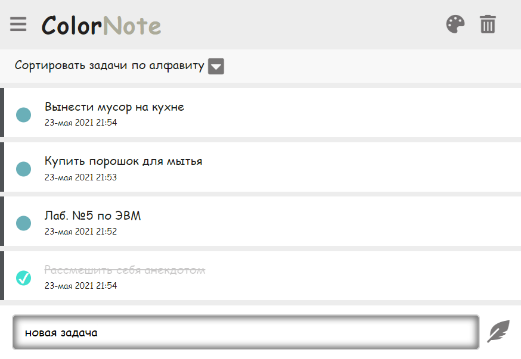

# Красивый TodoList на нативном JS
TodoList доступно [по этой ссылке](https://baktybek0v.github.io/TodoList_NativeJS/)

##Функционал
1. Создавать задачи
2. Изменять задачи
3. Зачеркивать задачи
4. Удалять задачи
5. Сортировать задачи: по алфавиту, по дате создания, по состояние
6. Имеется 3 темы на выбор, которые меняет как фон так и дизайн включая шрифтов текста
7. Автоматическое запоминание всех изменений в TodoList (localStorage)

##Примечание:
1. Сортировка по цвету не работают как и возможность выбора цвета задачи (скоро будет исправлено)

##Внешний вид (тема по умолчанию)

